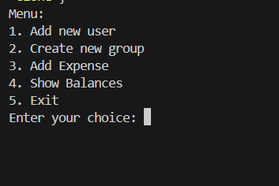
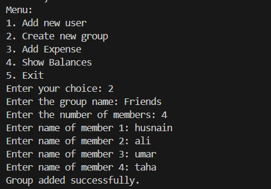
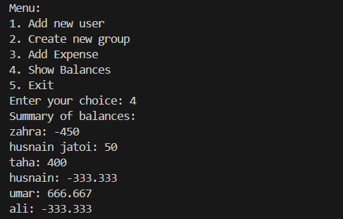

# Splitwise Clone (C++ Console App)

A simple command-line application that mimics the core functionality of Splitwise — helping users manage shared expenses, groups, and balances. Built using C++ with persistent data storage via file I/O.


## 🔑 Main Features
- User registration  
- Group creation with members  
- Expense splitting among group members  
- Balance calculation and summary display  
- Persistent file storage and retrieval  


## 🧩 Feature Breakdown

### User Registration
- Prompts for a unique username  
- Prevents duplicate usernames  
- Stores user info in a file  

### Group Creation
- Users can create named groups  
- Add members to each group  
- Group info is stored with members listed  

### Expense Addition
- Users specify group, amount, and payer  
- Expense is divided equally among members  
- Balances are adjusted and saved  

### Balance Display
- View individual and group balance summaries  
- Data is retrieved and formatted from saved files  


## 🛠 Tech Stack
- C++  
- File I/O (text-based persistence)  
- Console-based interface  
- Structured using functions and arrays

## 📁 How to Run

1. Clone the repository
```bash
git clone https://github.com/husnainjatoi/splitwise-clone
```
2. Compile using any C++ compiler  
```bash
g++ splitwise-clone.cpp -o splitwise-clone
```
3. Run the application  
```bash
./splitwise-clone
```

## 📸 Screenshots

<p align="center">
  
  <br><br>
  
  <br><br>
  
</p>

## 📌 Notes
This project was built to practice core programming logic, struct-based data handling, and file management in C++. It simulates core expense-sharing features similar to the Splitwise app in a terminal environment.
